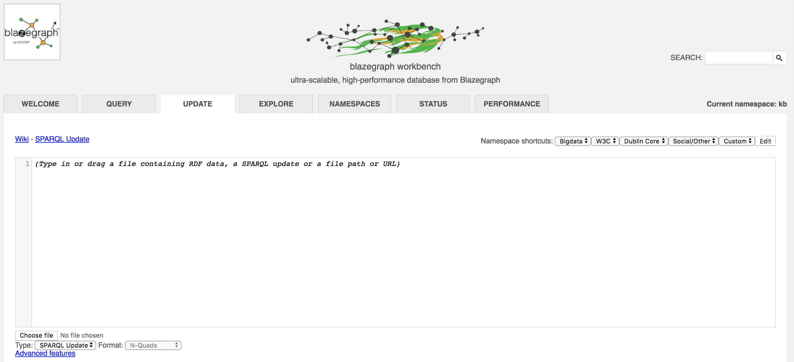

# graph-application
A simple web application that is talking to the graph database Blazegraph. The point of this tutorial is to provide anyone
the ability to run a graph database and write a simple web application over it.

## Knowledge Graphs
Knowledge graphs are part of symbolic AI. In short they capture what humans mean when they use certain words e.g. when you search for "Jaguar", do you mean the animal or the car brand.
For example, at Zalando, the workplace of the author, understanding the customers' language in search and talking to customers in a language they understand is very important, and the Fashion Knowledge Graph build at Zalando drives that.

## About this Tutorial
This tutorial will help you to set up our own graph databases, add data into it, and use it in a web application.
It will give you a quick start to building and hosting your own knowledge graph.
If you want to explore the topic further in some of your applications, you can use this technology and expand on it.

# Getting started

## Requirements

Make sure you have installed [Docker](https://docs.docker.com/install/)

## Running a Graph Database

For this tutorial I am using [Blazegraph](https://wiki.blazegraph.com/wiki/index.php/About_Blazegraph) graph database,
because it is open-source and [most-likely](https://www.i-programmer.info/news/84-database/11358-amazon-neptune-graph-database.html)
Amazon neptune available on AWS is [based on Blazegraph](https://www.i-programmer.info/news/84-database/11358-amazon-neptune-graph-database.html).
Certainly the experience of using both is the same.


### Run Blazegraph from a Docker image
The easiest way to run Blazegraph is to use a popular Docker image. You can find
those in Dockerhub. In this tutorial we will use [lyrasis/blazegraph](https://hub.docker.com/r/lyrasis/blazegraph/).

Make sure you have installed [Docker](https://docs.docker.com/install/)

Then run the following command to run Blazegraph according to the chosen docker image.
```
docker run --name blazegraph -d -p 8889:8080 lyrasis/blazegraph:2.1.4
```

To see the dashboard for Blazegraph, navigate with your browser to the [localhost port 8889](http://localhost:8889/bigdata/).

### Add Data to Blazegraph

Make sure you have Blazegraph running. You can see that it is running by typing

```
docker ps
```

Navigate to the dashboard of Blazegraph [localhost port 8889](http://localhost:8889/bigdata/)
and choose the tab "Update"



Below the big text edit field, you can spot a button saying "Choose file". This is where you can upload an RDF Data file
in several formats (N-Quads, N-Triples, N-Triples-RDR, Notation3, RDF/XML, JSON, TriG, TriX, Turtle, Turtle-RDR). To get you started
you can upload the [Turtle file on clothing materials](data/clothing_materials.ttl) found in the data folder of this tutorial.

The contents of the TTL file appears in the empty text box and by clicking "Update" below the contents is uploaded in the graph database.

### Query Data from Blazegraph

Congratulations! If you have managed to follow all steps of this tutorial, then you are now running a graph database with some data in it. You can test this data by running a few SPARQL queries for it.

Navigate to the Blazegraph Dashboard and go to the tab that says "Query". In the big text input field add your query and then press "Execute" to run it. Below are some example queries that you can run:


***QUERY 1*** See all classes defined in your graph
```
prefix owl: <http://www.w3.org/2002/07/owl#>
prefix rdf: <http://www.w3.org/1999/02/22-rdf-syntax-ns#>

    SELECT ?class_labels ?iri
        WHERE {
    ?iri rdfs:label ?class_labels ;
        rdf:type owl:Class .
}
```

***QUERY 2*** See all immediate instances of "clothing material"
```
prefix owl: <http://www.w3.org/2002/07/owl#>
prefix rdf: <http://www.w3.org/1999/02/22-rdf-syntax-ns#>
prefix ns: <http://www.example.org/myexample#>


    SELECT ?class_labels ?iri
        WHERE {
    ?iri rdfs:label ?class_labels ;
        rdf:type ns:clothing_material .
}
```

***QUERY 3*** See all instances including sub-classes of instances of "clothing material"
```
prefix owl: <http://www.w3.org/2002/07/owl#>
prefix rdf: <http://www.w3.org/1999/02/22-rdf-syntax-ns#>
prefix ns: <http://www.example.org/myexample#>


    SELECT ?class_labels ?iri
        WHERE {
    ?iri rdfs:label ?class_labels ;
        rdfs:subClassOf*/rdf:type ns:clothing_material .
}
```

## Creating a Simple Web App on top of your Graph
You should have now a way to upload and read data to your graph database. Next step is to build a simple web app
on top of the data you are storing in your graph database. For this we are using a simple [express JavaScript](https://expressjs.com/en/starter/installing.html) file and one [Embedded JavaScript](http://ejs.co/) template file
to render a simple view with data coming out of the graph.


After that in the root folder

```npm install```